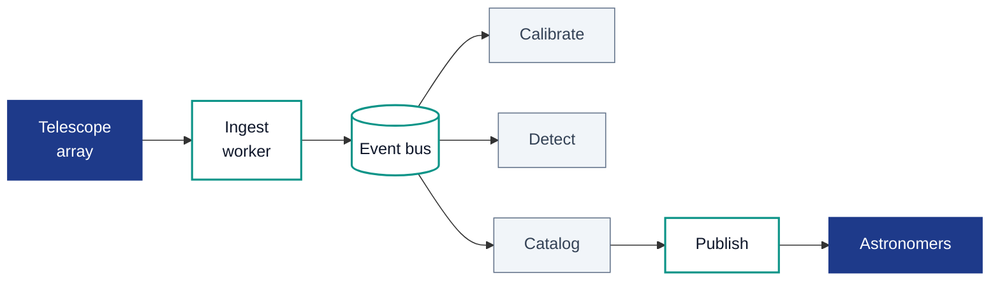

<!-- layout: title -->
# Meridian
## From photon to published catalog in twelve hours
<!-- notes: Open with the outage story from March. Meridian is the processing pipeline, not the telescope. -->

---

<!-- layout: content -->
<!-- label: The Problem -->
## A night of observations was taking nine days to reach astronomers

Every hour the Meridian array captures two terabytes of raw frames. For most of 2025, the gap between photons and a reviewable catalog was measured in weeks, not hours.

- Calibration ran on a single node with no retries
- Object detection depended on a twenty-year-old C binary
- Every failure required a human to re-queue the batch
- Astronomers were waiting, not observing

---

<!-- layout: divider -->
<!-- number: 01 -->
# Pipeline rebuild, ground up

---

<!-- layout: two-column -->
<!-- label: Before vs After -->
## What changed at the architectural level

### Before 2025
- Monolithic Python orchestrator
- Shared NFS for intermediate files
- Manual re-queue on every crash
- One astronomer on pager per night

***

### After rebuild
- Event-driven workers on Kubernetes
- Object storage with content addressing
- Automatic retries with dead-letter queue
- Pager duty is exception-only

---

<!-- layout: table -->
<!-- label: Stage Budget -->
## Each stage has a latency SLO we actually hit

| Stage           | Input          | Output             | P95 latency | Owner     |
|-----------------|----------------|--------------------|-------------|-----------|
| Ingest          | Raw FITS       | Content-addressed  | 4 min       | Platform  |
| Calibrate       | Raw frame      | Flat-fielded       | 12 min      | Photonics |
| Detect          | Calibrated     | Source list        | 22 min      | Detection |
| Catalog         | Source list    | Catalog rows       | 8 min       | Catalog   |
| Publish         | Catalog rows   | API + mirror       | 2 min       | Platform  |

---

<!-- layout: diagram -->
<!-- label: Dataflow -->
## Stages communicate through a single event bus

---

<!-- layout: content -->
<!-- label: Operating Principles -->
## Four principles the rebuild was designed around

- Every failure should retry itself before paging a human
- Every intermediate artifact is content-addressed and immutable
- Every stage exposes the same health and latency signals
- Every deploy is reversible within five minutes

---

<!-- layout: references -->
## References

- **Meridian SRE runbook 2026-Q1** — Internal incident retrospectives and latency targets.
- **Event-driven architecture (Fowler, 2017)** — Informed the broker topology. <https://martinfowler.com/articles/201701-event-driven.html>
- **Content-addressed storage for scientific data (IVOA, 2023)** — Model for intermediate artifact handling.
- **Kubernetes event sources (CNCF, 2024)** — Event source patterns Meridian workers consume.
- **Photometric calibration pipelines (Schlafly et al., 2012)** — The algorithmic basis for stage two.
- **Pipeline SLO playbook** — Internal, `/runbooks/meridian/slo.md`.
